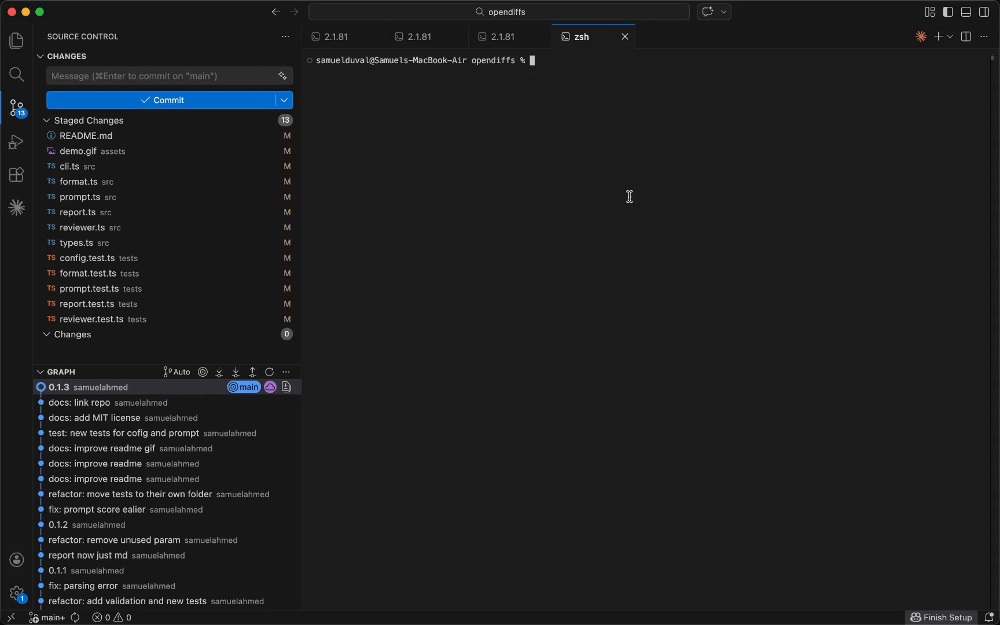

# OpenDiffs

Structured code review from the terminal, powered by your existing AI agents. No new accounts, no API keys, just your Claude or OpenAI subscription.

```bash
npm install -g opendiffs
```

Requires Node.js 18+ and [Claude Code](https://docs.anthropic.com/en/docs/claude-code) or [Codex](https://github.com/openai/codex).



Review your staged changes or any individual file before you commit. Your agent reads the diffs, explores your codebase for context, and gives you a structured review with a Diffs Score.

## How it works

Stage your changes, then run `opendiffs`:

```bash
opendiffs
```

From there, review all your staged changes or pick any individual file.

Your agent reads the diffs and checks your codebase. You get back a markdown review scored 1-10 with findings.

Note: your agents are doing real work — this will use your plans.

## Reviews

Reviews are saved as markdown in `.opendiffs/reviews/`, organized by branch. Browse them anytime:

```bash
opendiffs --reviews
```

> `.opendiffs/` is automatically added to `.gitignore`.

## Settings

```bash
opendiffs --settings
```

| Setting | Options | Default |
|---------|---------|---------|
| **Providers** | `claude`, `codex`, or both in parallel | `claude` |
| **Save reviews** | `always`, `staged-only`, `never` | `always` |
| **Max reviews** | any number | `50` |
| **Review prompt** | default or custom `.opendiffs/prompt.md` | default |

## Custom prompt

The default prompt tells your agent what to look for and how to score. To change it, go to `opendiffs --settings`, select "Review prompt", then select "Create .opendiffs/prompt.md". Once that file exists, your agent will use it instead of the default. Any edits you make to that file will be picked up on the next review.

## CLI

```
opendiffs                    Interactive — pick what to review
opendiffs --staged           Review staged changes directly
opendiffs <file>             Review a specific file
opendiffs --provider codex   Pick your agent (or claude,codex for both)
opendiffs --settings         Configure providers, prompt, reviews
opendiffs --reviews          Browse saved reviews
```

## License

MIT
